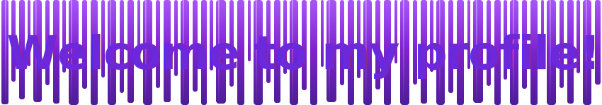

# Allah Ditta - Full Stack JavaScript Developer

## :bulb: Languages & Frameworks I code in

  

## :hammer_and_wrench: Things that help me getting my code done

  

## :rocket: Featured Projects

- [School Management System](https://github.com/AllahDitta-1/School-Managment-System) - role-based school platform with fees, attendance, exams, report cards, and portals.
- [My Finance App](https://github.com/AllahDitta-1/my-finance-app) - personal finance dashboard with accounts, transactions, budgets, reports, and settings.
- [Earning Hub](https://github.com/AllahDitta-1/earning-app) - earning and wallet app built with React, PHP, and MySQL.
- [WorkflowX](https://github.com/AllahDitta-1/WorkflowX) - full-stack task and project management system with authentication, tasks, and notifications.

  
  

  
  

## :chart_with_upwards_trend: GitHub Overview

  
  

  

## :busts_in_silhouette: How to reach me

